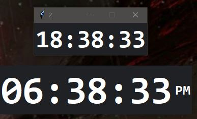

# Clock Widget
A digital clock to be placed on the Windows desktop using Python. Uses Tkinter and SQLite.

  

## Installation
- Have Python installed.
- Download and execute `clockWidget.pyw`.
- That's it! Enjoy.

## How to Use
- Right-click to pull up settings. Go nuts.

Note: Consider using Window's Task Scheduler (or your OS's equivalent) in order to open this application automatically upon device startup.

  

## Artifacts (Ignorable)~
### Project Origin
For a course's final project, the task description read: "All that we ask is that you build something of interest to you, that you solve an actual problem, that you impact your community, or that you change the world. **Strive to create something that outlives this course.**" From there, I wrote the initial version to [StickyNoteWidget](https://github.com/danbsolo/StickyNoteWidget). Feeling inspired, I then quickly wrote this application soon after for fun.

-> These updates? A remnant of my final semester at Algonquin College.

### Features
- Right-click window to open settings.
- Automatically saves size and location.
- Other than that, all it does is accomplish the bare minimum of a functional clock widget.